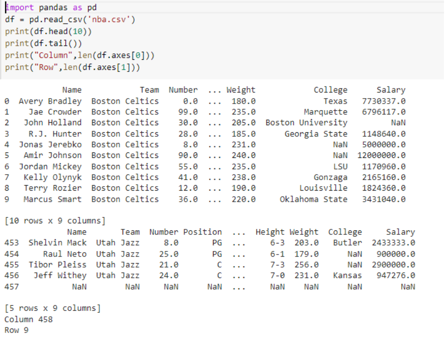

# Read-from-CSV

## AIM:

## ALGORITHM:
### Step 1:
### Step 2:
### Step 3:
### Step 4:
### Step 5:

## PROGRAM:
```
import pandas as pd
df = pd.read_csv('nba.csv')
print(df.head(10))
print(df.tail())
print("Column",len(df.axes[0]))
print("Row",len(df.axes[1]))
```
## OUTPUT:

## RESULT:
